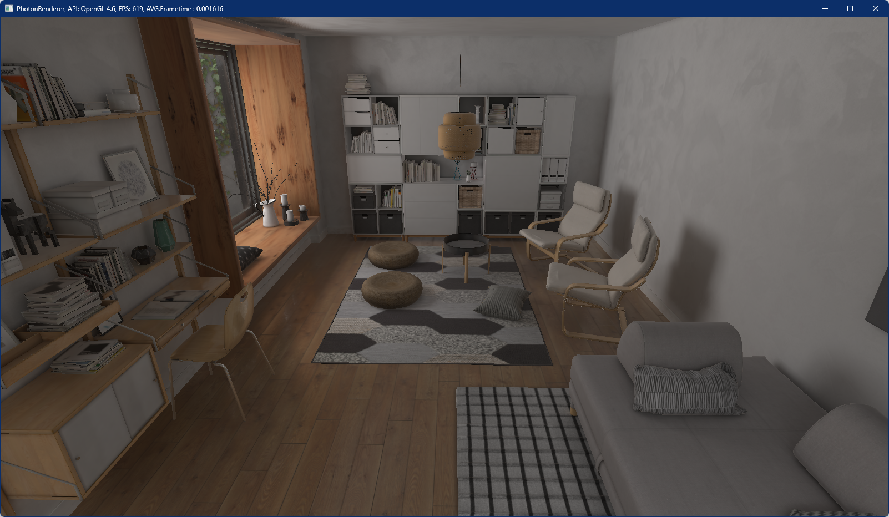
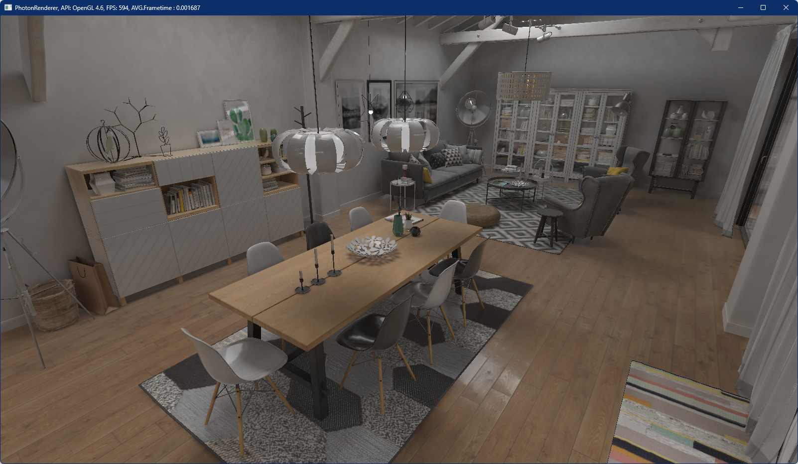
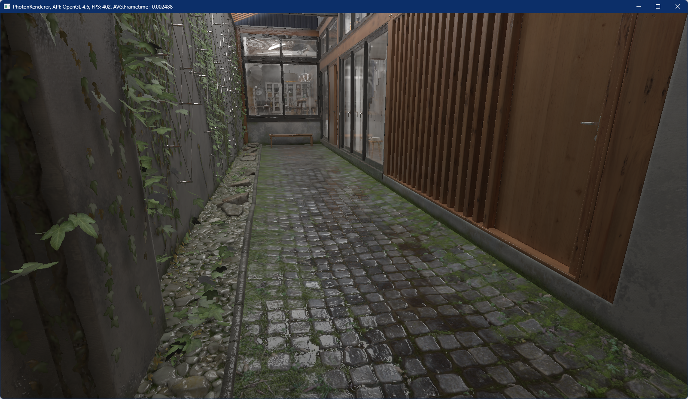
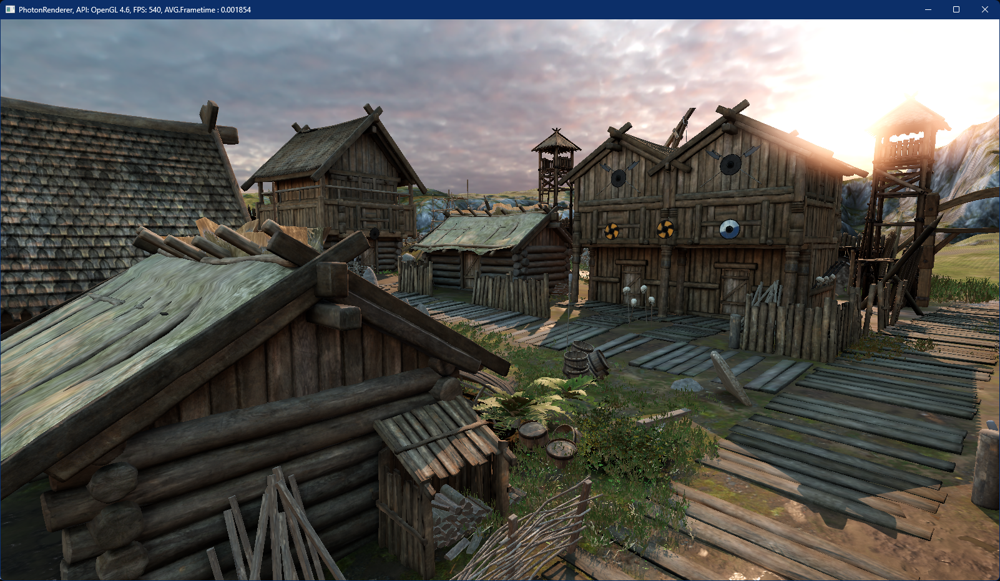
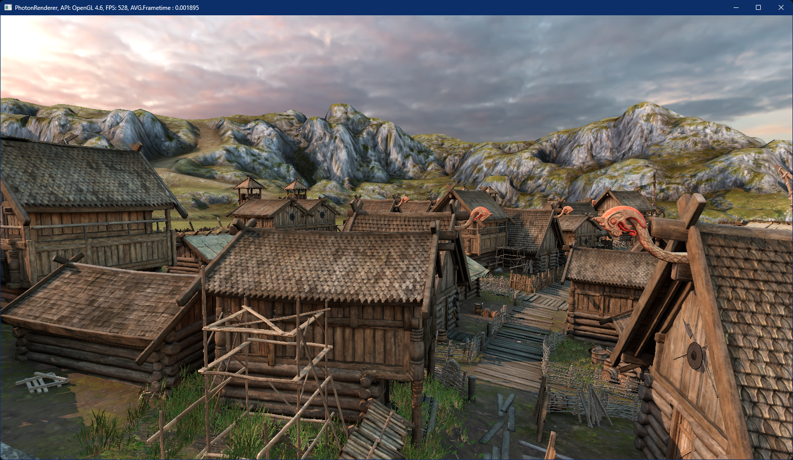
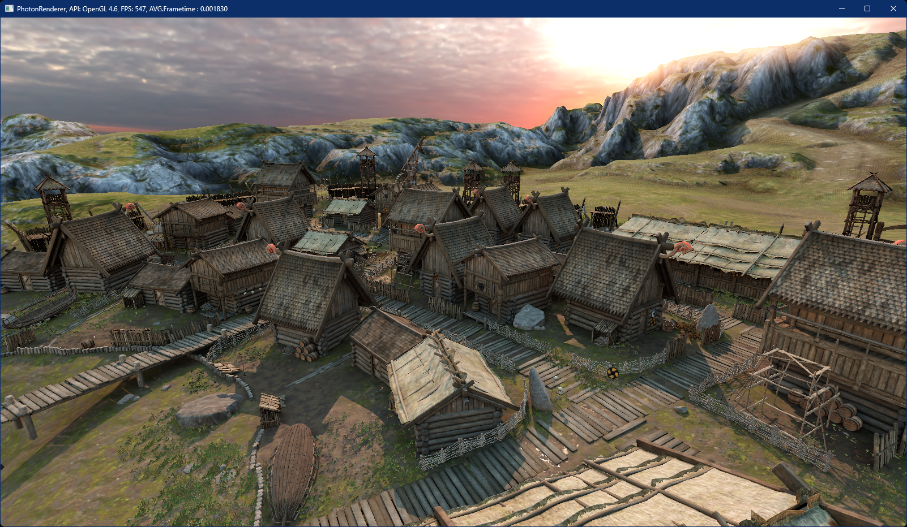

# C++ Unity Importer
This is a importer for importing GameObjects and Components from a Unity scene file. It parses the scene file and loads all references meshes, textures and other objects in memory. From there you can create your own graphic objects for your renderer. 

## Dependencies
- assimp: import over 40 3D file formats
- glm: vector and matrix math
- ktx: import KTX Texture files
- ryml: YAML support for importing Unity scenes
- stb-image: image file import (png, jpg, hdr)
- tiff: import TIFF image files
- tinyexr: import EXR image files

## Installation
Installation was tested on Win10/Win11 x64 with Visual Studio 2022/2026. It's recommended to use VCPKG for installation.

Requirenments: 
- CMake
- Git
- Visual Studio 2022 or later

### Build dependencies
Download and install [VCPKG](https://github.com/microsoft/vcpkg). Set environment variable VCPKG_DEFAULT_TRIPLET=x64-windows.

Install dependencies:
```
./vcpkg.exe install assimp glm ktx ryml stb tiff tinyexr
```

### Building
Open CMake-GUI
- set source path to ./libuimp/
- set build path to ./libuimp/build
- press configure and select your visual studio version and the platform x64
- select specify toolchain file for cross-compiling
- set toolchain file to: <vcpkg_root>/scripts/buildsystems/vcpkg.cmake
- press generate and open solution
- select configuration Release x64 and Build Solution

### Screenshots
Here are some screenshots from imported Unity scenes in a custom rendering engine.






